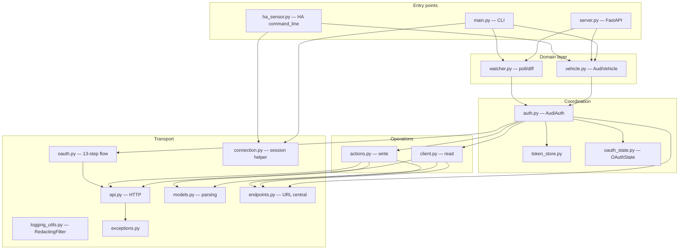

# Architecture

## Overview

`myaudi-api` is a standalone Python client and FastAPI server for the Audi Connect (myAudi) service. The HTTP protocol is reverse-engineered from the official myAudi Android app v4.31.0 — there is no documented public API. The codebase is async-first (`aiohttp`, `asyncio.gather`) and single-replica by design (in-memory cache, slowapi limiter, filesystem token store, single watcher loop).

## Layered architecture

## Module responsibilities

The table below covers `audi_connect/`. Public symbols are those re-exported by `audi_connect/__init__.py` plus those used outside the package (notably `OAuthState`, `AudiEndpoints`, `RedactingFilter`).

| Module | Responsibility | Public types/functions |
|---|---|---|
| `audi_connect/api.py` | Low-level HTTP client (timeout 30s, 3× exponential backoff retry on transport errors). | `AudiAPI` |
| `audi_connect/auth.py` | Coordinator: holds an `OAuthState`, wires `client`/`actions`/`oauth`/`token_store`/`endpoints`. Exposes `login` (returns vehicle list) and `refresh_tokens`. | `AudiAuth` |
| `audi_connect/oauth.py` | 13-step OAuth/OIDC login flow. HTML form scraping, PKCE, X-QMAuth HMAC. | `AudiOAuth` |
| `audi_connect/oauth_state.py` | Frozen dataclass holding all 10 token/endpoint fields after login. `from_dict` / `to_dict` / `with_refresh`. | `OAuthState` |
| `audi_connect/client.py` | Read-only API calls (selective status, parking position, trip data). | `AudiVehicleClient` |
| `audi_connect/actions.py` | Write API calls (lock/unlock with S-PIN security tokens, climate, heater). | `AudiVehicleActions` |
| `audi_connect/endpoints.py` | URL building (CARIAD per country, per-VIN) and home-region cache shared by `client` + `actions`. | `AudiEndpoints`, `cariad_url` |
| `audi_connect/vehicle.py` | `AudiVehicle` — domain object with properties (range, doors, climate, etc.) and idempotent-only retry on actions. | `AudiVehicle`, `MIN_/MAX_*` constants |
| `audi_connect/watcher.py` | Shared poll + state-diff logic used by both CLI watch and API background watcher. | `diff_states`, `check_vehicles` |
| `audi_connect/models.py` | Response parsing. `VehicleDataResponse` indexes fields/states by name for O(1) lookup. | `VehicleDataResponse`, `TripDataResponse`, `LockState`, `DoorState`, `WindowState` |
| `audi_connect/token_store.py` | Filesystem persistence of `OAuthState` (`~/.audi_connect_tokens.json`, 1h TTL, 0o600 on Unix). | `TokenStore` |
| `audi_connect/connection.py` | `create_session()` (SSL via certifi) + `connect_and_get_vehicles()` shortcut for one-shot CLI flows. | `create_session`, `connect_and_get_vehicles` |
| `audi_connect/logging_utils.py` | `RedactingFilter` masks bearer tokens, OAuth JSON, X-QMAuth, emails from log records. | `redact`, `RedactingFilter` |
| `audi_connect/utils.py` | Helpers (`get_attr`, `parse_int`, `parse_float`, `parse_datetime`, `to_byte_array`). | `get_attr`, `parse_int`, `parse_float`, `parse_datetime`, `to_byte_array` |
| `audi_connect/exceptions.py` | Exception hierarchy. | `AudiConnectError`, `AuthenticationError`, `TokenRefreshError`, `VehicleNotFoundError`, `ActionFailedError`, `SpinRequiredError`, `CountryNotSupportedError`, `RequestTimeoutError` |

## Design constraints

- **Single-replica only.** Vehicle data cache, slowapi rate limiter, token store on local filesystem, and the background watcher loop all assume one process. Banner enforced in headers of `server.py` and `audi_connect/token_store.py`.
- **Audi rate limit ~6 req/h.** Defaults are conservative: 4h vehicle data cache, 15-min minimum watcher interval, 30/min read + 5/min write per-IP via slowapi.
- **OAuth flow is fragile.** It scrapes HTML login forms via `BeautifulSoup` and uses an HMAC secret extracted from the Android APK byte array. Any upstream change (form structure, X-QMAuth secret rotation, captcha rollout) breaks authentication.
- **Async-first.** Every I/O path is `async`. Vehicle status fetch parallelises status + position + trips via `asyncio.gather()`.
- **No database.** Tokens persist to a single JSON file. Concurrent writers (e.g. two replicas on a shared volume) would race; this is documented and intentional.
