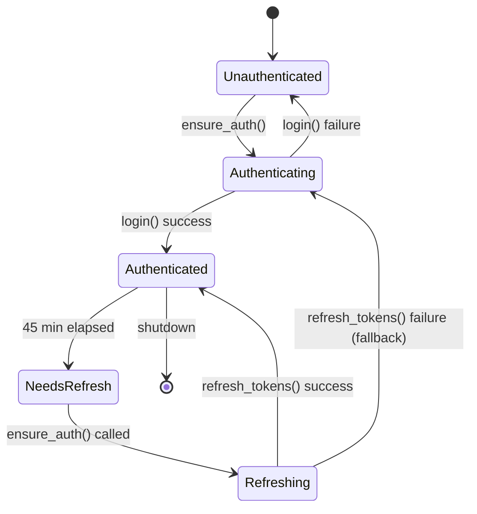
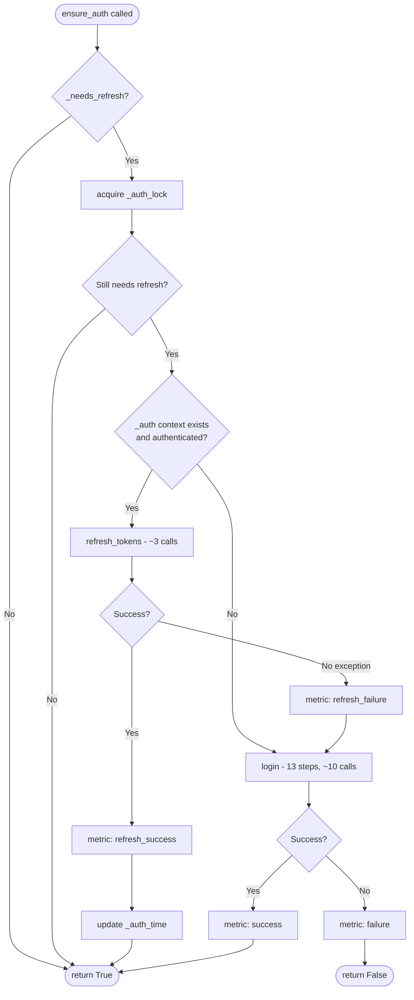

# Auth lifecycle

How tokens are obtained, cached, refreshed, and re-used across the three caching layers in this project.

## Three layers of caching/refresh

1. **In-memory tokens** — held by an `AudiAuth` instance as a single `OAuthState` (frozen dataclass with 10 fields: bearer_token, audi_token, vw_token, mbb_oauth_token, xclient_id, client_id, token_endpoint, authorization_server_base_url, mbb_oauth_base_url, language). Lives for the duration of the process.
2. **Filesystem token cache** — `~/.audi_connect_tokens.json` written by `TokenStore.save(state)`. Loaded on next start by `TokenStore.load()`. Default TTL: **3600 seconds (1 hour)**, validated by `TokenStore.load(max_age_seconds=3600)` against the embedded `saved_at` field. File mode `0o600` on Unix (no chmod on Windows). See [audi_connect/token_store.py](../audi_connect/token_store.py).
3. **Server-side refresh interval** — `server.py` declares `TOKEN_REFRESH_INTERVAL = 45 * 60` (45 minutes). Beyond this, `AudiClient._needs_refresh()` returns True and `ensure_auth()` is allowed to renew tokens. The 45-min budget sits comfortably under the 1-hour token lifetime so refreshes happen before tokens expire.

## Token state machine

## ensure_auth() flow with refresh_tokens wiring

Wired in PR #31 (commit `d0bc10d`). Before that PR, every refresh window triggered a full 13-step login (~10 upstream round-trips). Now the incremental path costs 3 calls and only falls back to full login on failure or when no auth context exists yet.

Note: when `refresh_tokens()` returns `False` (no refresh was needed because the existing tokens are still valid), `ensure_auth()` simply bumps `_auth_time` and returns True — no call to `login()`, no metric increment. Only an exception path counts as `refresh_failure`.

## Cache layer interaction

- **At process start**: `AudiAuth.login()` calls `_try_restore_tokens()` first. If a valid filesystem cache exists (age < 1h), it is loaded into the in-memory `OAuthState` and validated by fetching the vehicle list (one GraphQL call). If validation succeeds, the full 13-step flow is skipped. If validation fails (token expired or revoked server-side), the cache is cleared and the full flow runs.
- **On successful full login**: `AudiAuth._save_tokens()` writes the new state to disk via `TokenStore.save(state)`. The on-disk format is identical to the pre-`OAuthState` shape (10 token fields + `saved_at`) — existing cache files migrate silently.
- **On successful `refresh_tokens()`**: same — `_save_tokens()` is called, the freshly-rotated tokens land on disk and survive process restarts up to the TTL.
- **`refresh_tokens()` does NOT re-fetch the vehicle list**. Only full `login()` does. This is intentional: refresh stays cheap.

## Operational notes

- Watch `audi_auth_refresh_total{result}` in Grafana. Healthy distribution over 24h with a single replica + active background watcher:
  - ~32 `refresh_success` (one every 45 min)
  - 0–1 `refresh_failure`
  - 1–2 `success` (fallback full login)
  - ~0 `failure` (only on Audi outage or rate-limit lockout)
- **Many `refresh_failure` falling through to login** → typically the password was changed in the myAudi app, or a session was revoked. Re-running `python main.py setup` and a one-shot login resolves it.
- **Many `failure` (login)** → captcha rolled out, IP block, or X-QMAuth secret was rotated upstream. The latter is the worst case and requires re-extracting the secret from a fresh APK.
- The 1-hour filesystem TTL is conservative. On a stable installation, the cache file is overwritten roughly every 45 min (after each refresh) so it rarely expires by age alone.
