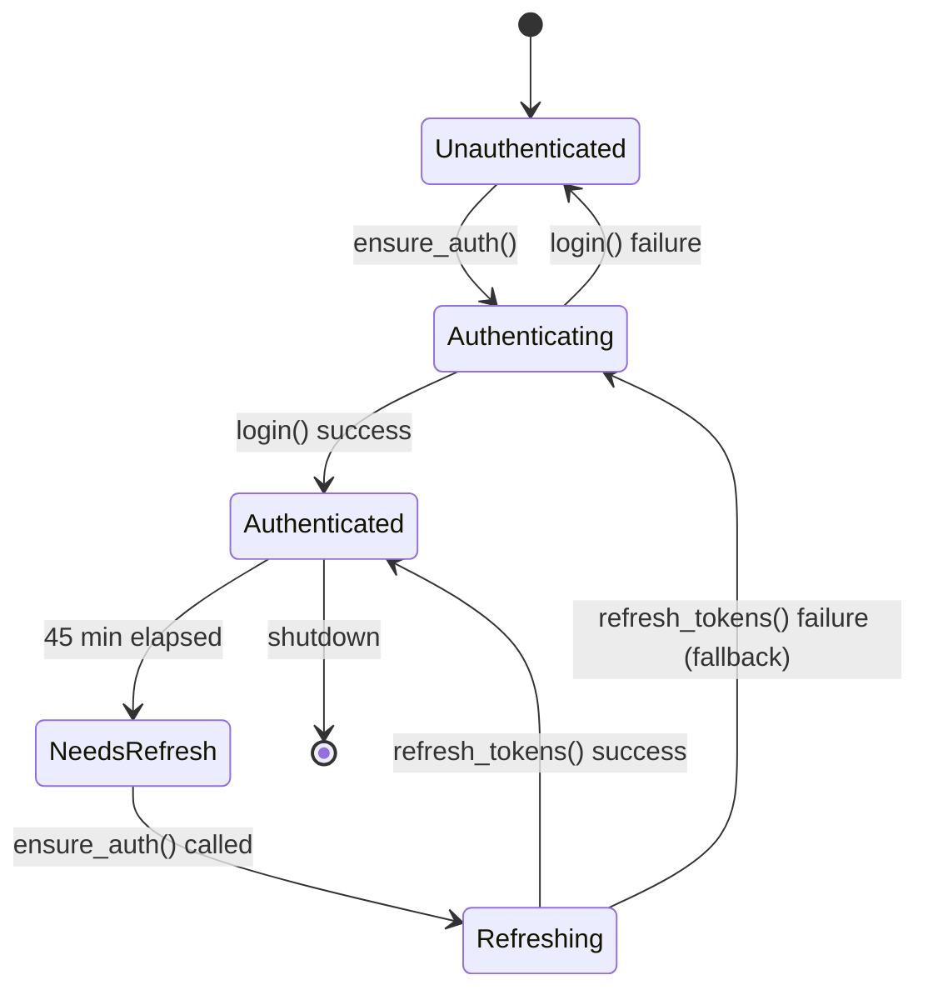
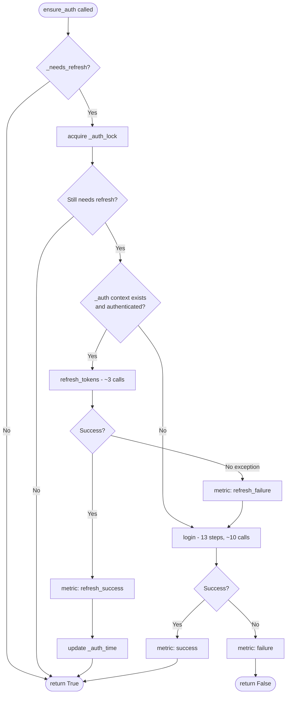

# Auth lifecycle

How tokens are obtained, cached, refreshed, and re-used across the three caching layers in this project.

## Three layers of caching/refresh

1. **In-memory tokens** — held by an `AudiAuth` instance as a single `OAuthState` (frozen dataclass with 10 fields: bearer_token, audi_token, vw_token, mbb_oauth_token, xclient_id, client_id, token_endpoint, authorization_server_base_url, mbb_oauth_base_url, language). Lives for the duration of the process.
2. **Filesystem token cache** — `~/.audi_connect_tokens.json` written by `TokenStore.save(state)`. Loaded on next start by `TokenStore.load()`. Default maximum age: **30 days**, checked against the embedded `saved_at` field. This is a cache policy, not a guarantee of token validity. Access tokens expire sooner; persisted refresh tokens allow non-interactive renewal. File mode `0o600` on Unix (no chmod on Windows). See [audi_connect/token_store.py](../audi_connect/token_store.py).
3. **Server-side refresh interval** — `server.py` declares `TOKEN_REFRESH_INTERVAL = 45 * 60` (45 minutes). Beyond this, `AudiClient._needs_refresh()` returns True and `ensure_auth()` is allowed to renew tokens. The 45-min budget sits comfortably under the 1-hour token lifetime so refreshes happen before tokens expire.

## Token state machine

```mermaid
stateDiagram-v2
    [*] --> Unauthenticated
    Unauthenticated --> Authenticating: ensure_auth()
    Authenticating --> Authenticated: login() success
    Authenticating --> Unauthenticated: login() failure
    Authenticated --> NeedsRefresh: 45 min elapsed
    NeedsRefresh --> Refreshing: ensure_auth() called
    Refreshing --> Authenticated: refresh_tokens() success
    Refreshing --> Authenticating: refresh_tokens() failure (fallback)
    Authenticated --> [*]: shutdown
```

## ensure_auth() flow with refresh_tokens wiring

Wired in PR #31 (commit `d0bc10d`). Before that PR, every refresh window triggered a full 13-step login (~10 upstream round-trips). Now the incremental path costs 3 calls and only falls back to full login on failure or when no auth context exists yet.

```mermaid
flowchart TD
    start([ensure_auth called]) --> check{_needs_refresh?}
    check -->|No| ok([return True])
    check -->|Yes| lock[acquire _auth_lock]
    lock --> recheck{Still needs refresh?}
    recheck -->|No| ok
    recheck -->|Yes| has_auth{_auth context exists<br/>and authenticated?}
    has_auth -->|No| login[login - 13 steps, ~10 calls]
    has_auth -->|Yes| refresh[refresh_tokens - ~3 calls]
    refresh --> ok_r{Success?}
    ok_r -->|Yes| metric_rs[metric: refresh_success]
    metric_rs --> bump[update _auth_time]
    bump --> ok
    ok_r -->|No exception| metric_rf[metric: refresh_failure]
    metric_rf --> login
    login --> login_ok{Success?}
    login_ok -->|Yes| metric_s[metric: success]
    login_ok -->|No| metric_f[metric: failure]
    metric_s --> ok
    metric_f --> fail([return False])
```

Note: when `refresh_tokens()` returns `False` (no refresh was needed because the existing tokens are still valid), `ensure_auth()` simply bumps `_auth_time` and returns True — no call to `login()`, no metric increment. Only an exception path counts as `refresh_failure`.

## Cache layer interaction

- **At process start**: `AudiAuth.login()` calls `_try_restore_tokens()` first. A cache within the 30-day age limit is loaded into `OAuthState`; stale access tokens are refreshed before vehicle-list validation. If validation fails despite passing the freshness gate (for example, an expired AZS token), a forced refresh and one validation retry are attempted. Successful refresh persists rotated tokens. If refresh or validation still fails, the current implementation clears the cache and attempts full login; in EU this may then fail with `DeviceGrantRejectedError`.
- **On successful full login**: `AudiAuth._save_tokens()` writes the new state to disk via `TokenStore.save(state)`. The on-disk format is identical to the pre-`OAuthState` shape (10 token fields + `saved_at`) — existing cache files migrate silently.
- **On successful `refresh_tokens()`**: same — `_save_tokens()` is called, the freshly-rotated tokens land on disk and survive process restarts up to the TTL.
- **`refresh_tokens()` does NOT re-fetch the vehicle list**. Only full `login()` does. This is intentional: refresh stays cheap.

## Operational notes

- Watch `audi_auth_refresh_total{result}` in Grafana. Healthy distribution over 24h with a single replica + active background watcher:
  - ~32 `refresh_success` (one every 45 min)
  - 0–1 `refresh_failure`
  - 1–2 `success` (fallback full login)
  - ~0 `failure` (only on Audi outage or rate-limit lockout)
- **Many `refresh_failure` falling through to login** → inspect the actual error; revoked tokens and network/backend errors can both cause failures. Re-running setup is not a guaranteed recovery: EU fresh login is currently refused for this client.
- **`unauthorized_client` on EU device authorization** → client/grant refusal before user sign-in, not a credential or S-PIN error. See [EU login status](oauth-flow.md#eu-login-status-2026-10-01).
- Preserve the token file across restarts/deployments; do not delete a working session to troubleshoot this refusal. Successful refresh rotates and saves tokens. Existing sessions may continue working while the provider accepts their refresh tokens, but this is not guaranteed indefinitely.
- The 30-day cache limit and existing refresh/fallback behavior are unchanged by the device-grant diagnostic fix. A file past that limit is still cleared by `TokenStore.load()`; the client cannot recover a fresh EU session reliably if its cached session is unusable.
