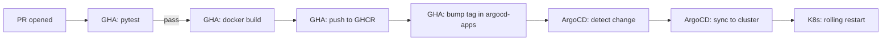

# Deployment

How the image gets built, pushed to GHCR, and deployed to the homelab Kubernetes cluster via ArgoCD.

## Image build

The `Dockerfile` is multi-stage (PR #26): a `python:3.12-slim` builder stage installs deps into `/opt/venv` with a BuildKit pip cache mount, then the runtime stage copies just the venv plus `audi_connect/` and `server.py`. Final image runs as `USER 1000` and ships a `HEALTHCHECK` that hits `/health` every 30 s. Entry point: `uvicorn server:app --host 0.0.0.0 --port 8000`.



Workflow file: [.github/workflows/build.yml](../.github/workflows/build.yml).

- `pull_request` runs only `test` (no GHCR push).
- `push` to `main` runs `test` then `build` (gated by `needs: test`).
- The `build` job ends with a `sed` against `apps/myaudi-api/deployment.yaml` in the `argocd-apps` repo to bump the `image:` tag to the new SHA-7. ArgoCD picks up the commit and reconciles.

Image registry: `ghcr.io/john6810/myaudi-api`. Tags: `<short-sha>` plus `latest`.

## Kubernetes deployment

- Cluster: homelab two-node setup `kame01` (control-plane + worker) / `kame02` (worker), Ubuntu 24.04, K8s v1.32.
- GitOps: ArgoCD ApplicationSet auto-discovering `apps/*/` in the `argocd-apps` repo; `apps/myaudi-api/` holds the manifests for this service.
- Namespace: `myaudi-api`.
- Replicas: **1** by design (cf [architecture.md](architecture.md) — single-replica invariant). Strategy: `Recreate` (no rolling — there's only one pod and the in-process state can't be split).
- Resource requests typical for the API tier: `~50m CPU / 128Mi memory request`, `200m / 256Mi limit`. Adjust if metrics show pressure.

## Secrets

Sealed-secrets, NOT raw `kubectl create secret`. The plaintext never lands in any repo.

- Sealed-secret name: `audi-credentials` (namespace `myaudi-api`).
- Required keys:
  - `AUDI_USERNAME`
  - `AUDI_PASSWORD`
  - `AUDI_SPIN` (only if you want lock/unlock; otherwise omit and the server runs without those endpoints' write capability)
  - `AUDI_API_KEY` — strongly recommended; without it, all protected endpoints return 503
  - `AUDI_WEBHOOK_SECRET` — only if `AUDI_WEBHOOK_URL` is also set and you want signed webhooks
- Referenced in `deployment.yaml` via `envFrom: - secretRef: name: audi-credentials`.

To rotate `AUDI_API_KEY`:

```bash
NEW=$(python -c "import secrets; print(secrets.token_urlsafe(32))")
kubectl create secret generic audi-credentials -n myaudi-api \
  --from-literal=AUDI_API_KEY="$NEW" \
  --dry-run=client -o yaml | \
  kubeseal --controller-namespace kube-system -o yaml > sealed-patch.yaml
# merge into argocd-apps/apps/myaudi-api/sealed-secret.yaml, commit, push.
# ArgoCD reconciles, the new pod starts with the new key.
# Don't forget to propagate the new key to consumers (n8n, HA, etc.).
```

## Probes — status: PENDING

Not wired in `argocd-apps` yet. Tracked as a follow-up. Expected manifests:

```yaml
livenessProbe:
  httpGet: { path: /health, port: 8000 }
  periodSeconds: 30
  failureThreshold: 3
readinessProbe:
  httpGet: { path: /ready, port: 8000 }
  periodSeconds: 10
  failureThreshold: 3
startupProbe:
  httpGet: { path: /health, port: 8000 }
  periodSeconds: 10
  failureThreshold: 12  # 2 min budget for the OAuth 13-step on cold start
```

Once added, kubelet will only route traffic to the pod after `/ready` returns 200 (i.e. after the first successful login), and the cold-start budget covers the worst-case OAuth latency.

## ServiceMonitor — status: PENDING

Also a follow-up in `argocd-apps`. The Service must expose port 8000 with `name: http`. Expected ServiceMonitor:

```yaml
apiVersion: monitoring.coreos.com/v1
kind: ServiceMonitor
metadata:
  name: myaudi-api
  namespace: myaudi-api
  labels:
    release: kube-prometheus-stack   # confirm with: kubectl get prometheus -A -o jsonpath='{.items[*].spec.serviceMonitorSelector}'
spec:
  selector:
    matchLabels: { app: myaudi-api }
  endpoints:
    - port: http
      path: /metrics
      interval: 30s
```

Confirm the `release:` label matches the kube-prometheus-stack instance running on the cluster — the chart's default selector key, but it can be overridden.

## Consumers

Known clients calling this service in the homelab:

- **n8n** — workflows (meal-planner and others) hit `/brief` or specific `/{vin}/...` endpoints. Sends `X-API-Key`. If the webhook signing is enabled, the n8n webhook nodes that receive Audi state changes must verify the `X-Audi-Signature` header.
- **Home Assistant** — `command_line` sensor invoking `ha_sensor.py` (CLI path, not REST). Reads the same `.env`. No `X-API-Key` involved here.
- **Jordan-bot** — Discord bot, REST consumer. Sends `X-API-Key`.

When `AUDI_API_KEY` is rotated, all REST consumers above must be updated. The CLI consumer (Home Assistant via `ha_sensor.py`) is unaffected.
