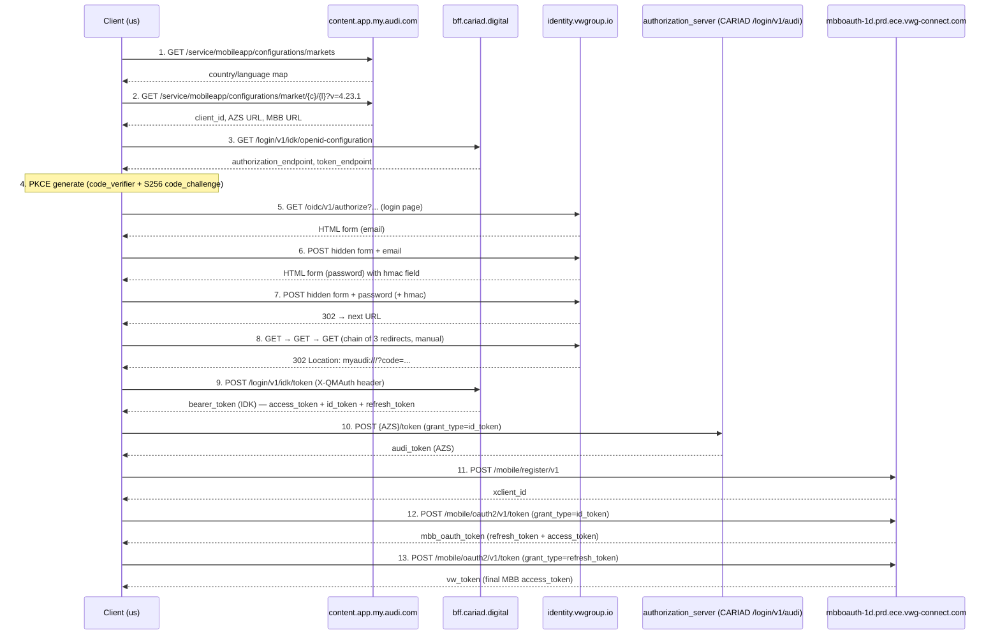

# OAuth flow (13 steps)

## Why a 13-step flow

The myAudi mobile app authenticates against the VW Group identity stack using OAuth2/OIDC with PKCE, plus an HMAC-signed `X-QMAuth` header, plus several token exchanges across three backends (IDK / AZS / MBB). We emulate the Android client (`X-App-Version: 4.31.0`, User-Agent `Android/4.31.0 ...`) to be accepted. Each step below is annotated in `audi_connect/oauth.py` with a `# Step N:` comment for grep-ability.

## Sequence diagram



## Step-by-step reference

All step numbers match the `# Step N:` comments in [audi_connect/oauth.py](../audi_connect/oauth.py).

### 1. Market configuration

- **Endpoint**: `GET https://content.app.my.audi.com/service/mobileapp/configurations/markets`
- **Purpose**: list of supported countries with their default language. Used to validate `AUDI_COUNTRY` and pick the language sent in subsequent requests.
- **Response**: JSON, navigated via `markets_json["countries"]["countrySpecifications"][country]["defaultLanguage"]`.
- **Implemented at**: `oauth.py:100-115`.

### 2. Dynamic config

- **Endpoint**: `GET https://content.app.my.audi.com/service/mobileapp/configurations/market/{country}/{language}?v=4.23.1`
- **Purpose**: per-country IDK client_id, AZS base URL, MBB OAuth base URL. Falls back to hard-coded defaults if the keys are absent.
- **Response keys looked up**: `idkClientIDAndroidLive`, `myAudiAuthorizationServerProxyServiceURLProduction`, `mbbOAuthBaseURLLive`.
- **Implemented at**: `oauth.py:117-138`.

### 3. OpenID discovery

- **Endpoint**: `GET https://emea.bff.cariad.digital/login/v1/idk/openid-configuration` (or `na.bff.cariad.digital` for `US`)
- **Purpose**: standard OIDC discovery — pulls `authorization_endpoint` and `token_endpoint`.
- **Implemented at**: `oauth.py:139-150`.

### 4. PKCE challenge

- **No HTTP call.** Generate `code_verifier` from 32 random bytes, base64-urlsafe encoded; derive `code_challenge` as `SHA-256(code_verifier)` base64-urlsafe encoded. Method `S256`. Plus `state` and `nonce` UUIDs.
- **Implemented at**: `oauth.py:151-165`.

### 5. Authorize / login page

- **Endpoint**: `GET {authorization_endpoint}` (typically `https://identity.vwgroup.io/oidc/v1/authorize`) with query params: `response_type=code`, `client_id`, `redirect_uri=myaudi:///`, `scope` (long list including `mbb openid profile vin email phone …`), `state`, `nonce`, `prompt=login`, `code_challenge`, `code_challenge_method=S256`, `ui_locales=de-de de`.
- **Response**: HTML login form. We keep the cookies for the next step.
- **Implemented at**: `oauth.py:166-191`.

### 6. Submit email

- **Endpoint**: `POST` to the URL extracted from the login form's `<form action=…>`.
- **Payload**: all hidden inputs from the previous HTML + `email`.
- **Response**: HTML password form (with an `hmac` value embedded as JS literal we extract via regex).
- **Implemented at**: `oauth.py:192-202`.

### 7. Submit password

- **Endpoint**: same form action, with `identifier` rewritten to `authenticate` in the path.
- **Payload**: same hidden inputs + `hmac` (extracted via regex from the email-step HTML) + `password`.
- **Response**: 302 redirect with `Location` header pointing to the next URL in the auth chain.
- **Implemented at**: `oauth.py:203-221`.

### 8. Follow redirect chain

- **Endpoints**: three sequential `GET` calls, each one following the `Location` header of the previous, with `allow_redirects=False`. The third response's `Location` is the final `myaudi:///?code=…&state=…` URL.
- **Implemented at**: `oauth.py:222-244`. We then parse the authorization code out of the synthetic `myaudi:///` URL.

### 9. Exchange code for IDK bearer token

- **Endpoint**: `POST {token_endpoint}` (typically `https://emea.bff.cariad.digital/login/v1/idk/token`)
- **Headers**: `X-QMAuth: v1:01da27b0:<HMAC>` (see below), `Content-Type: application/x-www-form-urlencoded`.
- **Payload**: `grant_type=authorization_code`, `code`, `redirect_uri=myaudi:///`, `response_type=token id_token`, `client_id`, `code_verifier`.
- **Response**: `bearer_token_json` containing `access_token` (IDK bearer), `id_token`, `refresh_token`.
- **Implemented at**: `oauth.py:245-268`.

### 10. AZS (Audi) token exchange

- **Endpoint**: `POST {authorization_server_base_url}/token` (typically `https://emea.bff.cariad.digital/login/v1/audi/token`)
- **Headers**: `X-App-Name: myAudi`, `X-App-Version: 4.31.0`, `Content-Type: application/json`.
- **Payload**: `{token: bearer_token.access_token, grant_type: "id_token", stage: "live", config: "myaudi"}`.
- **Response**: `audi_token` — used later for the GraphQL vehicle list.
- **Implemented at**: `oauth.py:269-291`.

### 11. Register MBB OAuth client

- **Endpoint**: `POST {mbb_oauth_base_url}/mobile/register/v1` (typically `https://mbboauth-1d.prd.ece.vwg-connect.com/mbbcoauth/mobile/register/v1`)
- **Payload**: hard-coded device fingerprint emulating a Samsung Galaxy A40: `{client_name: "SM-A405FN", platform: "google", client_brand: "Audi", appName: "myAudi", appVersion: "4.31.0", appId: "de.myaudi.mobile.assistant"}`.
- **Response**: `xclient_id` — used as `X-Client-ID` header on every subsequent legacy MBB call. We also keep the response cookies for step 13.
- **Implemented at**: `oauth.py:292-315`.

### 12. MBB OAuth token (initial)

- **Endpoint**: `POST {mbb_oauth_base_url}/mobile/oauth2/v1/token`
- **Headers**: `X-Client-ID: {xclient_id}`, `Content-Type: application/x-www-form-urlencoded`.
- **Payload**: `grant_type=id_token`, `token={IDK id_token}`, `scope=sc2:fal`.
- **Response**: `mbb_oauth_token` — keep the `refresh_token`, the `access_token` here is short-lived and replaced in step 13.
- **Implemented at**: `oauth.py:316-340`.

### 13. MBB token refresh (immediate)

- **Endpoint**: same `POST {mbb_oauth_base_url}/mobile/oauth2/v1/token`
- **Payload**: `grant_type=refresh_token`, `token={mbb_oauth_token.refresh_token}`, `scope=sc2:fal`.
- **Cookies**: those from step 11 are passed through.
- **Response**: `vw_token` — the actual MBB access token used by `client.py` and `actions.py` for legacy MBB calls (trips, lock/unlock, legacy climate). The Android app does this immediate refresh-after-grant so we mirror it.
- **Implemented at**: `oauth.py:341-358`.

## HMAC X-QMAuth

The `X-QMAuth` header is required on token-exchange calls (step 9). It is computed as:

```
gmtime_100sec = int(now_utc_unix / 100)
xqmauth_val   = HMAC-SHA256(secret, str(gmtime_100sec).encode("ascii"))
header        = "v1:01da27b0:" + hexdigest(xqmauth_val)
```

Where `secret` is a 32-byte array extracted from the myAudi Android APK v4.31.0. It is a static literal in `audi_connect/oauth.py` (`xqmauth_secret`), encoded in two's-complement-ish form (`256 - n` for negative bytes).

The 100-second window means a single computed value is valid for roughly 100 seconds, which is enough slack for clock drift and slow networks. Any rotation of the secret upstream (Audi rebuilding the APK with a new key) breaks every install of every client emulating the app, including ours, until the new secret is extracted and shipped.

## Token types produced

| Token | Source | Used for | Lifetime | Refreshable |
|---|---|---|---|---|
| `bearer_token` (IDK) | step 9 | CARIAD selectivestatus, parkingposition, climatisation, auxiliaryheating | ~1h | yes — refresh via step 9 with `grant_type=refresh_token` |
| `audi_token` (AZS) | step 10 | Audi GraphQL endpoint (vehicle list) | ~1h | yes — re-derived from a fresh IDK `id_token` via step 10 |
| `vw_token` (MBB) | step 13 | Legacy VW Group endpoints (trips, lock/unlock, legacy climate, home-region discovery) | ~1h | yes — `grant_type=refresh_token` against the MBB token endpoint |

`AudiAuth.refresh_tokens()` (in `audi_connect/auth.py`) refreshes all three in 3 upstream calls — see [auth-lifecycle.md](auth-lifecycle.md).

## Failure modes

- **HTML form structure changes upstream** → `BeautifulSoup` parsing breaks, login dies at step 6 or 7. Symptom: `KeyError` on a hidden input name or empty `regex_res` for the `hmac` field.
- **X-QMAuth secret rotation** → step 9 returns 401/403. All authentication fails until the APK is re-extracted and a new secret literal is shipped.
- **Captcha or MFA challenge inserted** → the password POST returns extra hidden fields or a different form. Flow stalls without a clear error.
- **Audi rate limit hit** → 429 with a Retry-After header, or in worse cases the account is locked for hours and the official myAudi app also fails to log in. The `~6 req/h` budget defaults exist precisely to avoid this.
- **Refresh token revoked** (password change or session terminated in myAudi app) → `refresh_tokens()` fails, `ensure_auth()` falls back to a full login. Track via `audi_auth_refresh_total{result="refresh_failure"}` in Prometheus.
